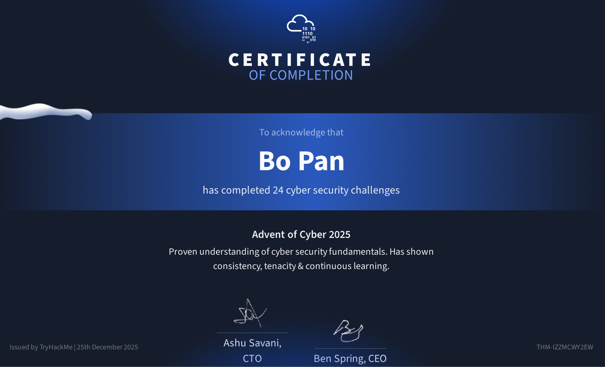

# Advent of Cyber
My journey saving the Christmas of Wareville!

This has been a fun journey with TryHackMe. I learned something new every day —sometimes a brand-new concept, sometimes realizing I _definitely_ didn’t know something as well as I thought I did. Overall, it was a great way to explore new cybersecurity topics while reinforcing the basics. Most importantly... Merry Soc-Mas!!!

  
 

## Index
- [day1-where-it-begins](day1-where-it-begins.md)
- [day2-phishing](day2-phishing.md)
- [day3-splunk](day3-splunk.md)
- [day4-ai](day4-ai.md)
- [day5-IDOR](day5-IDOR.md)
- [day6-sandbox](day6-sandbox.md)
- [day7-network-discovery](day7-network-discovery.md)
- [day8-hacking-ai](day8-hacking-ai.md)
- [day9-cracking-password-on-files](day9-cracking-password-on-files.md)
- [day10-SOC-triage](day10-SOC-triage.md)
- [day11-XXS](day11-XXS.md)
- [day12-phishing](day12-phishing.md)
- [day13-YARA](day13-YARA.md)
- [day14-docker-container](day14-docker-container.md)
- [day15-web-attack-forensics](day15-web-attack-forensics.md)
- [day16-windows-registry-forensics](day16-windows-registry-forensics.md)
- [day17-cyberchef](day17-cyberchef.md)
- [day18-obfuscation](day18-obfuscation.md)
- [day19-industrial-control](day19-industrial-control.md)
- [day20-racing-condition](day20-racing-condition.md)
- [day21-malware-analysis](day21-malware-analysis.md)
- [day22-c2](day22-c2.md)
- [day23-aws](day23-aws.md)
- [day24-curl](day24-curl.md)
