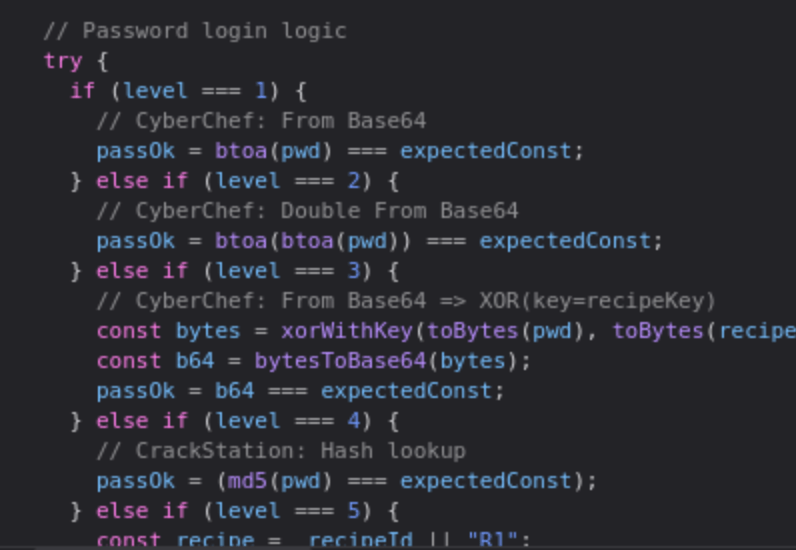

# Cyber Chef 
Today we played around with cyber chef - the swiss army in cyber securty. We checkout different encoding tehcnique such as base64 and MD5. It was fun to follow along with the hint that was **secretly** hidden in the Javascript code : )

