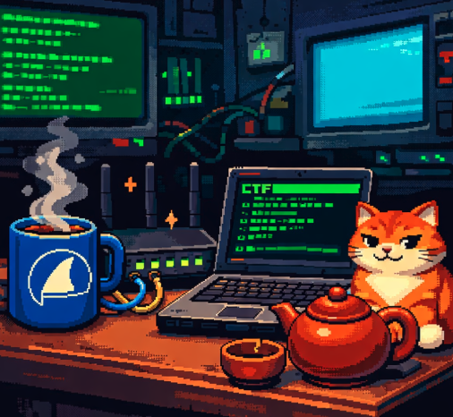

# Bo's SOC Analyst Logbook

 
   

- [My Half Quarter Review](../mid-review.md) (yoohoo! half way through!)
- [My Third Quarter Review](../third-quarter-review.md) 

## Technical Skills
- Framework
	- [Cyber Kill Chain - What's happening, Captain? ](framework/cyber-kill-chain.md)
	- [MITRE - The nerdy Encyclopedia ](framework/MITRE.md)
	- [Pyramid of Pain - Can this be more Painful?](framework/Pyramid-of-Pain.md)

- Tool Box
	- [SIEM](tools/SIEM.md)
	- [EDR](tools/EDR.md)
	- [SOAR](tools/SOAR.md)
	- [Splunk](tools/Splunk.md)
	- [Kibana](tools/Kibana.md)
	- [Wireshark](tools/wireshark.md)
	- [Snort](tools/snort.md)

- Analysis 
	- [Phishing Analysis](phishing-analysis/phishing.md)
	- [Network Analysis](network-analysis/network-analysis.md)

* Monitoring
	* [Web Security Monitoring](web-monitoring/web-monitoring.md)
	* [Linux Security Monitoring](linux-monitoring/linux-monitoring.md)
	* [Windows Security Monitoring](win-monitoring/windows-security-monitoring.md)
	
## Basic Skills
- [How to Write a Good Report?](5W-report.md)
- [SOC Workbook and Lookup](SOC-Workbook-and-Lookup.md)
- [SOC Metrics and Objectives](SOC-Metrics-and-Objectives.md)

