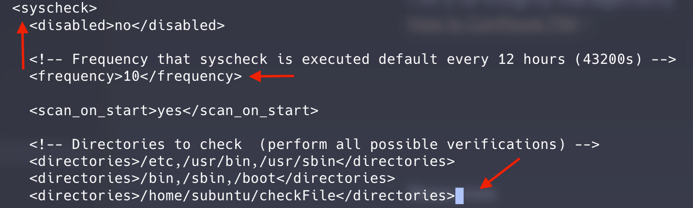
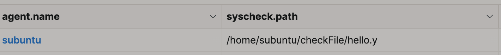

# Wazuh FIM (File Integrity Management)

  

## FIM (File Integrity Management)
This write-up assume you already have **Wazuh(Open-source tool for SIEM and XDR )** installed and have agents running. Maybe I will dedicate a page for Wazuh installation too. 

## What and Why is FIM important? 
Think of **File Integrity Monitoring** as that one friend who remembers _exactly_ how you left your apartment. If a burglar comes in and moves your "Joey Special" pizza two inches to the left, FIM is the one screaming, "Someone touched the crust!" 

In cybersecurity, if an attacker gains access, they almost always modify files to establish persistence, steal data, or escalate privileges. However, It’s not always as obvious as Ross’s teeth glowing under a blacklight. Sometimes it’s a tiny, subtle change that looks totally normal to the naked eye. That's where Wazuuuuh comes in!

## Setup in Wazuh

To configure, we need to edit ossec configuration file: \
In terminal, run: `vim /var/ossec/etc/ossec.conf`

We will be welcome by a bunch of noise. All we need is to find `<syscheck>` tag. If you are not famaliar with VIM editor. Here a trick - you type `/` then type the keyword you want to search. So in this case you type `syscheck` then you can use `n` to nevigate the search result. Once you locate yourself to the right place, place `i` to edit it. Lastly, hit `esc` and type `:wq` to save the change. 

Notice that I change the `frequency` to `10`. So our change can be picked up right away. 

Next, we insert this to the terminal (see screenshot) \
`<directories><FILEPATH_OF_MONITORED_FILE></directories>`\
Like how I did in the last line from the screenshot. Notice by default Wazuh aldeady have some folders configured. 

Then we leave VIM mode. Restart the agent by running: \
`systemctl restart wazuh-agent`

That's it! Everytime the folder get modified, we will see an alert on our FIM dashboard! \

## Resources:
- [John Hammond on Wazuh Installation](https://www.youtube.com/watch?v=i68atPbB8uQ)
- See details in [How to Configure FIM - The Official Doc](https://documentation.wazuh.com/current/user-manual/capabilities/file-integrity/how-to-configure-fim.html)

## Extended Readings:
- [Bo Cyber Logbook - SIEM](tools/SIEM.md)

---
Last Modified: 2025-12-29 \
Have Questions? Shoot me a text >> [Linkedin](https://www.linkedin.com/in/bopann/)

