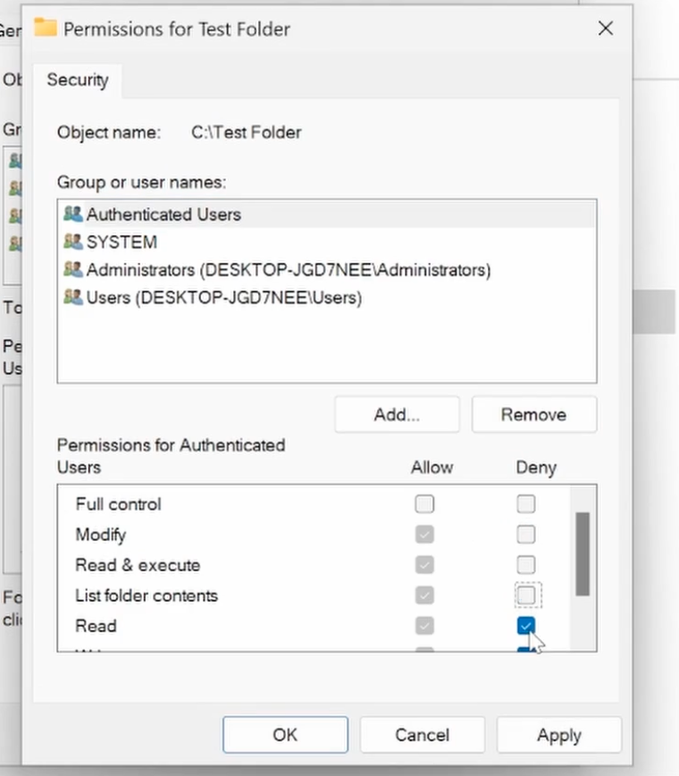

# Aministerin Local User Account

## 2. Overview
Access Control is about the user's privilege - who can do what?

## 3. Description
### 3.1  Two ways to administering users
- go to control panel
- go to local user and gourp (run -> lusrmgr.msc)

### 3.2 admin account vs sstandard user account
- admin has the highest privilege and permission
- standar users usually have more restriction

### 3.3 File Permission
Like Linux, Windows use groups to assign permissions to multiple users efficiently. Worth noting is that -  In Windows, file permissions are managed using **NTFS Access Control Lists (ACLs)** which have more granular control over permission.

## Why it Matters?
Access Control Management is a important part of the help desk job. It is also about the data security of the company assets. 

